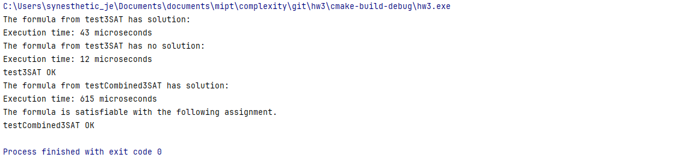

## Assignment 3: study the approximation of NP-hard problem solutions
### Part 1

В качестве NP-полной задачи была выбрана задача выполнимости булевых формул _3-satisfiability_
($3SAT.h$). Приведем формальную постановку данной задачи. 

Дано:  
**Множество переменных** $X = \{x_1, x_2, ..., x_n\}$  
**Множество клаузул** $C_1, C_2, ..., C_m : \quad C_i = (l_{i1} \vee l_{i2} \vee l_{i3}), \quad$ 
где $l_{ij} \in \{ x_j, &not;x_j\}$

Найти $\{x_1, x_2, ..., x_n\}:$ 
$$\forall i \in \{1, 2, ..., m\}: \quad (C_i = l_{i1} \vee l_{i2} \vee l_{i3}) \quad and \quad (C_i = true)$$
Другими словами, $F = C_1 \wedge C_2 \wedge \ ... \ \wedge C_m = true$

**Оценка сложности решения:**

Сложность решения 3-SAT с использованием MiniSat может быть представлена, как $O (2^n)$, где $n -$ количество переменных.
Хоть MiniSat и использует различные эвристики и оптимизации, которые могут улучшить время работы в большинстве случаев, 
однако, в худшем случае, сложность алгоритма останется этанется экспоненциальной: $O (2^n)$.

**Объяснение:** Основную сложность в данный алгоритм добавляет метод $solver.solve()$, т.е. выполнение 
алгоритма SAT, который в худшем случае имеет экпоненциальную сложность. В качестве примера основных эвристик и оптимизаций 
MiniSat можно привести [_Unit Propagation_](http://cse.unl.edu/~choueiry/S19-235H/files/SATslides05.pdf) и _Conflict-Driven Clause Learning (CDCL)_.

### Part 2
Для эффективного приближенного решения задачи выполнимости булевых формул _3-satisfiability_ используем комбинированный подход, 
который объединяет 4 метода аппроксимации: _Greedy strategy_, _local search_, _Monte-Carlo_ и _Meta-heuristics (annealing)_.

_Приведем описание данного решения:_ На этапе инициализации алгоритм создает начальное решение при помощи _Greedy strategy_. 
Данная стратегия достаточно эффективна, поскольку позволяет быстро найти приближенное решение, которое используется для 
дальнейшей оптимизиации. Далее решение, полученное после этапа инициализации, улучшается при помощи локального поиска путем 
изменения значения одной переменной и проверки на улучшение. Одним из важных этапов данного алгоритма является метод Монте-Карло,
который добавляет элемент случайности для предотвращения остановки в локальных минимумах. Это происходит при случайном изменении 
значения переменных с $p = 0.5$. В качестве последнего этапа глобальной оптимизации данного алгоритма 
используется метаэвристика (иммитация отжига), который направлен на поиск глобального минимума.

**Оценка сложности алгоритма:**  
Оценим каждый из этапов алогритма и вычислим итоговую сложность.
 - **_Greedy strategy_** имеет сложность $O(n + m)$, где $m -$ количество клаузул, $n -$ количество переменных;  
    В функции _greedyInitialization_ на первом этапе происходит заполнение переменных случайными значениями ($O(n)$), после
    чего выполняется проверка на необходимость замены значений переменных в каждой клаузуле, длина которой составляет 3, 
    по условию задачи. Следовательно, это занимает $O(3 \cdot m) = O(m)$.
 - **_Local search_** имеет сложность $O(n \cdot m)$;  
    Если на каждом шаге функции _localSearch_ наблюдается улучшение, то количество итераций напрямую зависит от скорости 
    достижения локального минимума. Сложность худшего случая составляет $O(n \cdot m)$, поскольку происходит инверсия каждой 
    переменной и проверка результата. 
 - **_Monte-Carlo_** имеет сложность $O(1)$;  
    Поскольку число итераций ограничено, а каждая итерация инвертирует переменную и, соответственно, требует $O(1)$, то и
    сложность метода составляет $O(1)$.
 - **_Meta-heuristics (annealing)_** имеет сложность $O(m)$;  
    В функции _simulatedAnnealing_ на каждой итерации (число итераций ограничено) инвертируется 1 переменная и происходит 
    расчет нового значения. Расчет происходит за $O(m)$.

Таким образом, **итоговая сложность** составляет $O(n \cdot m) + O(n + m) + O(1) = O(n \cdot m)$, где $n -$ количество переменных,
$m -$ количество клаузул. В сравнении с ранее полученным результатом для решения 3-SAT с использованием MiniSat, которое 
оценивается в $O (2^n)$, данное решение выгллядит эффективнее. Однако, надо также учитывать, что несмотря на 
теоретическую экспоненциальную сложность, решение с использованием MiniSat очень эффективно на практике благодаря своим 
оптимизациям. Решение получается за полиномиальное время для большинства реальных случаев, но теоретически оно остается 
экспоненциальным. Также поскольку данный алгоритм использует эврестические методы, то отсутствует гарантия нахождения
оптимального решения, но на больших данных работает быстрее. 

Для сравнения временных характеристик можно привести произведенные измерения.

При решении 3-SAT с использованием MiniSat и комбинированного метода время выполнения на небольшом количестве данных приблизительно 
равно $43$ и $615$ $\mu s$ соответственно. Он становится эффективным на достаточно больших входных данных.